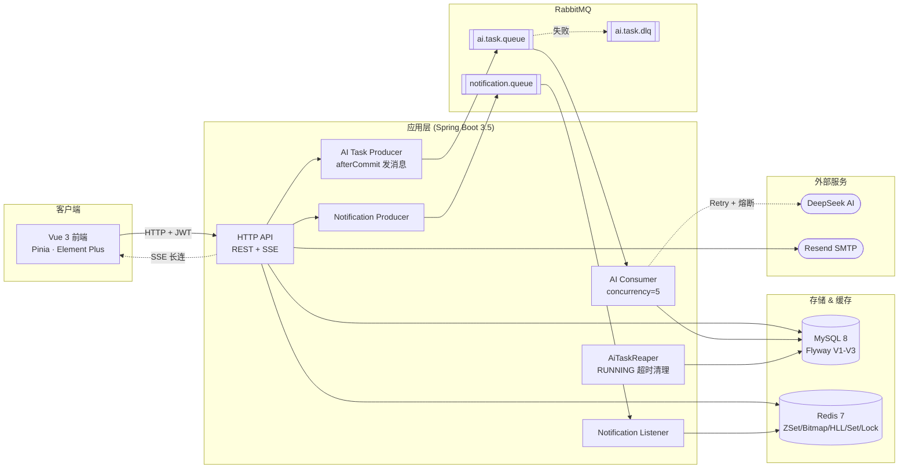
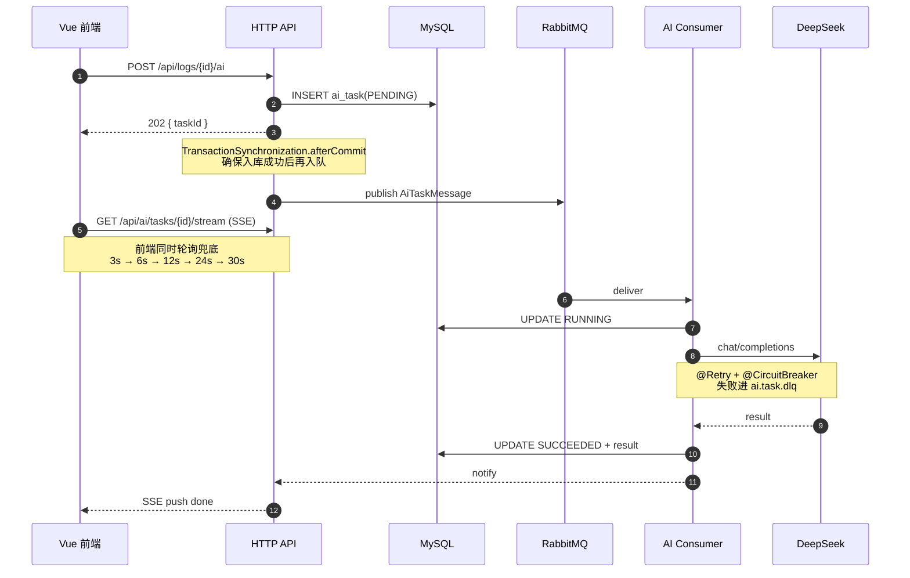

# Meaning Log


🌐 **在线体验**:[www.chada010.freeddns.org](https://www.chada010.freeddns.org)

> **快速体验(免注册)**
> - 🧪 **测试账号**:用户名 `test` / 密码 `123456`(可体验完整功能:社区 Feed、AI 分析、通知、报告等)
> - 🎭 **游客试用**:访问 [/trial](https://www.chada010.freeddns.org/trial) 直接体验 AI 日志分析,无需登录

AI 辅助日记应用。用户写下日志后,AI「小记」自动生成标题、摘要、标签,并可与用户多轮对话精修输出。同时内置**社区模块**:日志一键发布到公开 feed,支持点赞、评论、关注、SSE 实时通知,形成"个人写作 → 公开分享"的完整闭环。

**技术侧作为个人简历项目**,围绕真实业务复现了 MQ 异步化、Redis 多结构选型、Bitmap 幂等、分布式锁、SSE 双通道容灾、Resilience4j 熔断等工程能力,并配有 k6 压测数据(见 [性能压测](#性能压测))。

---

## 目录

- [架构一览](#架构一览)
- [核心工程能力](#核心工程能力)
- [性能压测](#性能压测)
- [技术栈](#技术栈)
- [API 端点](#api-端点)
- [本地运行](#本地运行)
- [环境变量](#环境变量)
- [持续集成](#持续集成)
- [开发文档](#开发文档)

---

## 架构一览



- **前端**:Vue 3 + Pinia + Element Plus,Token 存 localStorage,SSE + 轮询双通道容灾。
- **后端**:Spring Boot 3.5,MVC + SSE,MyBatis-Plus 访问 MySQL,Spring Data Redis 直接操作 Redis 原语。
- **异步**:所有 AI 调用走 RabbitMQ,HTTP 只返回 202 + `taskId`,消费者拉起后再打 DeepSeek(见 [核心工程能力 #1](#1-mq-异步化ai-接口从-5s-同步阻塞-→-202-入队--异步消费))。
- **数据**:Flyway 三份迁移(V1 初始 schema、V2 ai_task、V3 社区表),启动自动执行。

---

## 核心工程能力

下面 6 项是项目的工程重点。**其中第 2-5 项都以社区模块为落地场景**(feed 排序 / 幂等点赞 / 帖子并发发布 / 通知实时推送),把 Redis 多种数据结构、分布式锁、SSE 双通道等能力串在真实业务上。

### 1. MQ 异步化:AI 接口从 5s 同步阻塞 → 202 入队 + 异步消费

原始设计:HTTP 直接调 DeepSeek,单次 5s。Tomcat 200 线程池被 5s 请求占满,压测 100 VU 只能撑到 **QPS ~20 / P99 5130 ms**。

改造后 `POST /api/logs/{id}/ai` 立即返回 202 + `taskId`,任务写入 `ai_task` 表(状态 `PENDING`) → 通过 `TransactionSynchronizationManager.afterCommit` 发 MQ(**避免 dual-write:先入库成功再入队**) → Consumer(concurrency=5)拉起后调 DeepSeek → 写回 `SUCCEEDED` + result → 通过 SSE / 轮询通知前端。

**同一 mock 5s 压测下:QPS 429 / P99 399 ms,吞吐 21.8×、长尾 12.8×**(数字见 [性能压测](#性能压测))。

关键代码:

- [`mq/producer/AiTaskProducer.java`](meaning-log-backend/src/main/java/com/chad/meaninglog/mq/producer/AiTaskProducer.java) — 事务提交后入队
- [`mq/listener/AiTaskExecutor.java`](meaning-log-backend/src/main/java/com/chad/meaninglog/mq/listener/AiTaskExecutor.java) — 状态机 + DLQ 转发
- [`mq/listener/AiTaskDlqListener.java`](meaning-log-backend/src/main/java/com/chad/meaninglog/mq/listener/AiTaskDlqListener.java) — 死信队列消费
- [`service/AiTaskReaper.java`](meaning-log-backend/src/main/java/com/chad/meaninglog/service/AiTaskReaper.java) — `RUNNING` 超时清理

### 2. Redis 7 种数据结构选型:一个业务用对一个结构

社区模块几乎把 Redis 主流数据结构都用上,每一处都能对应到具体 Redis 命令:

| 场景 | 结构 | 关键类 |
|---|---|---|
| 热榜实时排序 + 分页 | ZSet | [`HotScoreJob`](meaning-log-backend/src/main/java/com/chad/meaninglog/service/community/job/HotScoreJob.java) · [`HotScoreCalculator`](meaning-log-backend/src/main/java/com/chad/meaninglog/service/community/HotScoreCalculator.java) |
| Feed 流时间倒序 | ZSet | [`CommunityFeedService`](meaning-log-backend/src/main/java/com/chad/meaninglog/service/community/CommunityFeedService.java) |
| 点赞幂等去重 | Bitmap | [`CommunityLikeService`](meaning-log-backend/src/main/java/com/chad/meaninglog/service/community/CommunityLikeService.java)(见 #3) |
| 计数刷回 | String INCR | [`CounterFlushJob`](meaning-log-backend/src/main/java/com/chad/meaninglog/service/community/job/CounterFlushJob.java) |
| 关注关系 | Set | [`CommunityFollowService`](meaning-log-backend/src/main/java/com/chad/meaninglog/service/community/CommunityFollowService.java) |
| PV 独立访客 | HyperLogLog | [`CommunityRedisService.logPv()`](meaning-log-backend/src/main/java/com/chad/meaninglog/service/community/CommunityRedisService.java) |
| 分布式锁 | SET NX PX + Lua | [`CommunityRedisService.acquireLock()`](meaning-log-backend/src/main/java/com/chad/meaninglog/service/community/CommunityRedisService.java)(见 #4) |

**为什么不用 Redisson** — 项目坚持"用 Redis 原语,不带框架黑盒",每个操作都能对应到底层 Redis 命令,面试可讲清楚选型和踩坑。

Feed / 热榜刷新用 Redis Pipeline 消除 N+1(见 commit `de8410b`)。

### 3. Bitmap 幂等点赞:MySQL Unique + Redis Bitmap 双兜底

问题:分布式系统里"用户是否已点赞"是极高频查询。查 MySQL 一次 1-2 ms,查 Redis String 每用户一 key 内存爆炸(1 亿 like 就 1 亿 key)。

方案:`SETBIT like:{logId} {userId} 1`,一个 bit 表示一个用户是否点过。`GETBIT` 判断幂等,`BITCOUNT` 拿总点赞数。

- **MySQL 侧**:`community_like(user_id, public_log_id)` UNIQUE 约束兜底,防 Redis 击穿造成重复计数。
- **Redis 侧**:`GETBIT` 判重 → `SETBIT` 写入 → `INCR` 计数;`CounterFlushJob` 定时刷回 MySQL。

[`service/community/CommunityLikeService.java`](meaning-log-backend/src/main/java/com/chad/meaninglog/service/community/CommunityLikeService.java)

### 4. 分布式锁:SET NX PX + Lua CAS 释放

用 Spring Data Redis 手撸,不用 Redisson:

- **加锁**:`SET lock:{key} {token} NX PX {ttl}` — token 为 UUID,每个持有者独占。
- **解锁**:通过 Lua 脚本原子比较 `GET == token` 后再 `DEL`,防止"锁过期 + 他人重锁 + 自己 DEL 掉他人的锁"经典问题。

用在社区帖子发布、点赞计数刷回等场景。

[`service/community/CommunityRedisService.java`](meaning-log-backend/src/main/java/com/chad/meaninglog/service/community/CommunityRedisService.java)

### 5. SSE 双通道容灾:主 SSE + 轮询指数退避兜底

AI 任务和通知都用 SSE 推送状态变更,但 SSE 在浏览器后台 tab、Nginx 中间层、代理断流等场景经常静默死连。

前端用 `Promise.any([SSE, 轮询])`,轮询采用指数退避 `3s → 6s → 12s → 24s → 30s`,5 分钟总超时兜底。任何一个通道先拿到 `SUCCEEDED` 就 resolve。JWT 过期(401)时自动登出。

- 后端:[`web/SseEmitterSupport.java`](meaning-log-backend/src/main/java/com/chad/meaninglog/web/SseEmitterSupport.java) · [`AiTaskController#stream`](meaning-log-backend/src/main/java/com/chad/meaninglog/controller/AiTaskController.java)
- 前端:[`src/api/stream.ts`](meaning-log-frontend/src/api/stream.ts) · [`src/api/aiTask.ts`](meaning-log-frontend/src/api/aiTask.ts)

### 6. Resilience4j 三件套:AI 调用不拖垮整个应用

`OpenAiTransport` 用 Resilience4j 挂了三层保护:

- **`@Retry`** — DeepSeek 偶发 5xx / 网络抖动时自动重试。
- **`@CircuitBreaker`** — 连续失败达阈值后短路,不再打 DeepSeek,直接走 fallback。
- **`fallback → AiUnavailableException`** — 前端拿到 502/503 显示"AI 暂不可用"软提示,**日记 CRUD 主流程不受影响**。

保证 AI 上游挂掉时,日记核心功能完全无损。

[`client/OpenAiTransport.java`](meaning-log-backend/src/main/java/com/chad/meaninglog/client/OpenAiTransport.java) · [`client/AiUnavailableException.java`](meaning-log-backend/src/main/java/com/chad/meaninglog/client/AiUnavailableException.java)

---

## 性能压测

用 k6 隔离变量,对比 "HTTP 同步调 AI" vs "HTTP 202 + MQ 异步消费" 在相同并发下的表现。**上游 AI 被 Mock 成 5s sleep**(通过 `loadtest` profile 切换),只对比架构收益,不含 DeepSeek 抖动。

### AI 异步请求路径



### 结果 (VU=100 稳态, 60s)

| 维度       | 同步 baseline | 异步 202     | 改善         |
|-----------|--------------:|-------------:|-------------:|
| QPS       | 19.64 /s     | 429.20 /s   | **21.8×**   |
| P50       | 5020 ms      | 218 ms      | 23×         |
| P95       | 5100 ms      | 319 ms      | 16×         |
| P99       | 5130 ms      | 399 ms      | **12.8×**   |
| 错误率     | 0.00%        | 0.01%       | 相当        |

**一句话**:同步接口的 QPS 上限严格等于 `Tomcat 线程池 / 单请求耗时`(200 / 5s = 40 理论上限,实测 ~20),AI 上游一慢整条 HTTP 就废。异步化把"等 AI"从 HTTP 生命周期挪到 MQ 消费者,天花板从 20 拉到 400+,长尾从 5s 压到 <400 ms。

完整的三档 VU 数据、跑法、以及压测暴露的 MQ back-pressure 现象讨论,见 [`scripts/loadtest/README.md`](scripts/loadtest/README.md)。

---

## 技术栈

| 层 | 技术 |
|---|---|
| 前端 | Vue 3.5 · TypeScript · Vite · Pinia · Vue Router · Element Plus |
| 后端 | Spring Boot 3.5.14 · Java 17 · MyBatis-Plus 3.5.16 · Spring Security · 手撸 JWT (HMAC-SHA256) |
| 数据库 | MySQL 8 · Flyway 迁移(V1 schema · V2 ai_task · V3 community) |
| 缓存 & 数据结构 | Redis 7(ZSet · Bitmap · HyperLogLog · Set · String · SET NX PX + Lua) |
| 消息队列 | RabbitMQ 3(AI 任务队列 · DLQ · 通知队列) |
| 熔断 & 重试 | Resilience4j(Retry + CircuitBreaker + fallback) |
| API 文档 | Knife4j 4.5 + springdoc 2.7(OpenAPI 3) |
| AI | DeepSeek(OpenAI 兼容 Chat Completions,默认模型 `deepseek-chat`) |
| 邮件 | Resend SMTP(隐式 TLS 2465) |
| 压测 | k6(Docker 版) |
| CI | GitHub Actions(前端 type-check + build,后端 test on 临时 MySQL/Redis) |

---

## API 端点

启动后端后访问 [http://localhost:8080/doc.html](http://localhost:8080/doc.html) 查看 Knife4j UI,以下是核心端点摘要。

### 认证 `/api/auth`

| Method | Path | 说明 |
|---|---|---|
| POST | `/send-code` | 发送邮箱验证码(60s 冷却) |
| POST | `/register` | 注册(需邮箱验证码) |
| POST | `/login` | 登录(`identifier` 支持邮箱或用户名) |
| POST | `/reset-password` | 重置密码(触发 tokenVersion +1 强制下线所有旧 Token) |
| GET | `/me` | 当前用户信息 |

### 日志 CRUD `/api/logs`

| Method | Path | 说明 |
|---|---|---|
| GET | `/` | 列表(分页 + 关键词 + 标签 + 日期) |
| GET | `/{id}` | 详情 |
| GET | `/{id}/navigation` | 上一篇 / 下一篇 |
| POST | `/` | 新建 |
| PUT | `/{id}` | 更新 |
| PUT | `/{id}/favorite` | 收藏 toggle |
| DELETE | `/{id}` | 删除 |
| GET | `/images/{imageId}` | 图片(Blob 存 `log_image` 表) |

### AI 日志分析(异步) `/api/logs` + `/api/ai/tasks`

| Method | Path | 说明 |
|---|---|---|
| POST | `/api/logs/{id}/ai` | **入队 AI 分析,返回 202 + taskId** |
| POST | `/api/logs/{id}/ai/chat` | 对话精修(SSE) |
| GET | `/api/logs/{id}/ai/chat` | 精修历史消息 |
| POST | `/api/logs/{id}/ai/apply` | 显式应用 AI 结果到日志 |
| GET | `/api/ai/tasks/{taskId}` | 轮询任务状态 |
| GET | `/api/ai/tasks/{taskId}/stream` | **SSE 推送任务状态** |

### 报告 `/api/logs/ai/*`

| Method | Path | 说明 |
|---|---|---|
| POST | `/ai/daily-summary` | 当日总结 |
| POST | `/ai/report` | 区间 AI 报告 |
| GET | `/ai/reports` | 报告列表 |
| POST | `/ai/reports/{reportId}/chat` | 报告二次对话精修 |
| POST | `/ai/reports/{reportId}/apply` | 应用报告 |

### 小记陪伴 `/api/xiaoji`

| Method | Path | 说明 |
|---|---|---|
| GET | `/sessions` | 会话列表 |
| GET | `/sessions/{sessionId}/messages` | 消息历史 |
| POST | `/chat` | 陪伴聊天(SSE 流式) |

### 社区 `/api/community`

| Method | Path | 说明 |
|---|---|---|
| POST | `/publish/{logId}` | 发布日志到社区 |
| GET | `/feed` | Feed 流(Redis ZSet) |
| POST | `/like/{publicLogId}` | **Bitmap 幂等点赞** |
| POST | `/comments/{publicLogId}` | 评论(带敏感词过滤) |
| POST | `/follow/{userId}` | 关注 |
| GET | `/users/{userId}/posts` | 用户主页 |

### 通知 `/api/notifications`

| Method | Path | 说明 |
|---|---|---|
| GET | `/` | 通知列表(分页 + 已读过滤) |
| GET | `/unread-count` | 未读数 |
| POST | `/read-all` | 全部已读 |
| GET | `/stream` | **SSE 推送新通知** |

### 游客试用 `/api/trial`

| Method | Path | 说明 |
|---|---|---|
| POST | `/analyze` | AI 分析(IP 限流,**不入库**) |
| POST | `/analyze/stream` | 流式 AI 分析(SSE) |

<details>
<summary>其他辅助端点</summary>

- `GET /api/logs/ai/tags` — AI 建议标签
- `DELETE /api/community/publish/{logId}` — 撤回发布
- `GET /api/community/posts/{publicLogId}` — 帖子详情
- `GET /api/community/comments/{publicLogId}` — 评论列表
- `DELETE /api/community/like/{publicLogId}` — 取消点赞
- `DELETE /api/community/follow/{userId}` — 取关
- `GET /api/community/users/{userId}` — 用户 profile
- `POST /api/notifications/{id}/read` — 标记单条已读
- `GET /api/logs/ai/reports/{reportId}` — 报告详情
- `GET /api/logs/ai/reports/{reportId}/chat` — 报告对话历史

</details>

---

## 本地运行

### 1. 前置

- Java 17
- Node.js 20+
- Docker Desktop(必需,用于 MySQL / Redis / RabbitMQ)

### 2. 首次配置

复制配置样例:

```cmd
copy .env.example .env
copy meaning-log-backend\application-local.properties.example meaning-log-backend\application-local.properties
copy meaning-log-frontend\.env.local.example meaning-log-frontend\.env.local
```

打开 `.env`,填写 Resend API Key,并将 `MAIL_FROM` 改为 Resend 已验证域名下的发件地址。打开 `meaning-log-backend/application-local.properties`,填写自己的 DeepSeek Key。

`.env`、`application-local.properties`、`application-docker.properties`、`.env.local` 均已 Git 忽略,真实密钥不进提交。

安装前端依赖:

```cmd
cd meaning-log-frontend && npm install
```

### 3. 启动

确认 Docker Desktop 已启动,在仓库根目录:

```powershell
powershell.exe -NoProfile -ExecutionPolicy Bypass -File .\scripts\start-local.ps1
```

脚本会:解析并校验 `.env` → 起 Docker Compose(MySQL / Redis / RabbitMQ)→ 等待健康 → 起后端 → 起前端 → 记录 PID 到 `logs/local-processes.json`。

- 前端:[http://localhost:5173](http://localhost:5173)
- 后端:[http://localhost:8080](http://localhost:8080)
- Knife4j:[http://localhost:8080/doc.html](http://localhost:8080/doc.html)
- RabbitMQ 控制台:[http://localhost:15672](http://localhost:15672)(`guest` / `guest`)

如果 8080 / 5173 已占用,脚本会直接退出,避免误认已启动的其他工作区进程。

停止:

```powershell
powershell.exe -NoProfile -ExecutionPolicy Bypass -File .\scripts\stop-local.ps1
```

停止脚本核对 PID 与启动时间后再终止,不会删除数据卷。

### 4. 验证

```bash
cd meaning-log-frontend
npm run type-check
npm run build

cd ../meaning-log-backend
./mvnw test
```

Windows 下最后一行改成 `.\mvnw.cmd test`。

### 5. 压测(可选)

见 [`scripts/loadtest/README.md`](scripts/loadtest/README.md)。

---

## 环境变量

后端主要配置在 `meaning-log-backend/src/main/resources/application.properties`,可通过环境变量覆盖。

<details>
<summary>数据库 / Redis / Compose</summary>

| 变量 | 说明 | 默认 |
|---|---|---|
| `MYSQLHOST` | MySQL 地址 | `localhost` |
| `MYSQLPORT` | MySQL 端口 | `3306` |
| `MYSQLDATABASE` | 数据库名 | `meaning_log` |
| `MYSQLUSER` | MySQL 用户 | `root` |
| `DB_PASSWORD` | MySQL 密码 | — |
| `REDIS_HOST` | Redis 地址 | `localhost` |
| `REDIS_PORT` | Redis 端口 | `6379` |
| `REDIS_PASSWORD` | Redis 密码 | 空 |
| `LOCAL_COMPOSE_PROJECT_NAME` | Compose 项目名覆盖(仅在复用旧数据卷时设 `meaning-log`) | 空 |

</details>

<details>
<summary>AI / JWT / 限流</summary>

| 变量 | 说明 | 默认 |
|---|---|---|
| `DEEPSEEK_API_KEY` | DeepSeek API Key | 无,必须配置 |
| `APP_AI_BASE_URL` | AI 接口基地址 | `https://api.deepseek.com/v1` |
| `APP_AI_MODEL` | AI 模型名 | `deepseek-chat` |
| `AI_RATE_LIMIT_MAX_REQUESTS` | 每 IP 每窗口期最大请求数 | `5` |
| `AI_RATE_LIMIT_WINDOW_SECONDS` | 限流窗口(秒) | `60` |
| `JWT_SECRET` | Base64 编码 JWT 密钥(解码后 ≥32 字节) | 生产必须配 |
| `AUTH_TRUSTED_PROXY_CIDRS` | 可信反向代理 CIDR,逗号分隔 | 空 |
| `AUTH_LOGIN_ATTEMPT_WINDOW_SECONDS` | 登录失败限流窗口 | `900` |
| `AUTH_LOGIN_MAX_ATTEMPTS_PER_SOURCE` | 单来源尝试次数上限 | `20` |
| `AUTH_LOGIN_MAX_ATTEMPTS_PER_PRINCIPAL_SOURCE` | 单账号单来源上限 | `5` |

</details>

<details>
<summary>邮件 (Resend SMTP)</summary>

| 变量 | 说明 | 默认 |
|---|---|---|
| `MAIL_HOST` | SMTP Host | `smtp.resend.com` |
| `MAIL_PORT` | SMTP Port(隐式 TLS) | `2465` |
| `MAIL_USERNAME` | SMTP 用户名 | `resend` |
| `MAIL_PASSWORD` | Resend 仅发信 API Key | 必配 |
| `MAIL_FROM` | 已验证域名下的发件地址 | 必配 |
| `MAIL_SMTP_SSL_ENABLE` | 隐式 TLS | `true` |
| `MAIL_SMTP_STARTTLS_ENABLE` | STARTTLS | `false` |
| `MAIL_CONNECTION_TIMEOUT_MS` / `MAIL_READ_TIMEOUT_MS` / `MAIL_WRITE_TIMEOUT_MS` | SMTP 三段超时 | `10000` 各 |
| `EMAIL_CODE_TTL` | 验证码 TTL(秒) | `300` |
| `EMAIL_CODE_COOLDOWN` | 同邮箱重发冷却(秒) | `60` |
| `EMAIL_CODE_SEND_MAX_ATTEMPTS_PER_SOURCE` | 单来源发送上限 | `5` / 分钟 |
| `EMAIL_CODE_SEND_MAX_ATTEMPTS_GLOBAL` | 全局发送上限 | `100` / 分钟 |

</details>

<details>
<summary>生产 JWT 密钥生成 & 反向代理注意事项</summary>

PowerShell 生成 32 字节 Base64 JWT 密钥:

```powershell
$bytes = New-Object byte[] 32
[System.Security.Cryptography.RandomNumberGenerator]::Create().GetBytes($bytes)
[Convert]::ToBase64String($bytes)
```

部署在 Nginx / LB 后时,必须将每个代理的专用地址显式配置到 `AUTH_TRUSTED_PROXY_CIDRS`(如 `10.0.0.2/32,192.168.100.4/32`)。该配置只接受 IPv4 `/32` 或 IPv6 `/128`,不能配客户端网段或 `0.0.0.0/0`。同时代理必须追加而非覆盖 `X-Forwarded-For`:

```nginx
proxy_set_header X-Forwarded-For $proxy_add_x_forwarded_for;
```

未配置可信 CIDR 时,后端会忽略 `X-Forwarded-For` 并使用直连地址。

</details>

---

## 持续集成

每个 push 和 PR 触发 GitHub Actions:

- 前端:`npm run type-check` + `npm run build`
- 后端:在临时 MySQL / Redis 服务中执行 `./mvnw test`

CI 不使用真实 DeepSeek Key,也不调用外部 AI 接口。

## 开发文档

- [`docs/development-baseline.md`](docs/development-baseline.md) — 开发基线与分层约束
- [`docs/manual-acceptance-checklist.md`](docs/manual-acceptance-checklist.md) — 手工验收清单
- [`docs/high-risk-areas.md`](docs/high-risk-areas.md) — 高风险改动区域
- [`scripts/loadtest/README.md`](scripts/loadtest/README.md) — 压测方案与完整数据
- [`CLAUDE.md`](CLAUDE.md) — 项目架构说明(Claude Code 用)
