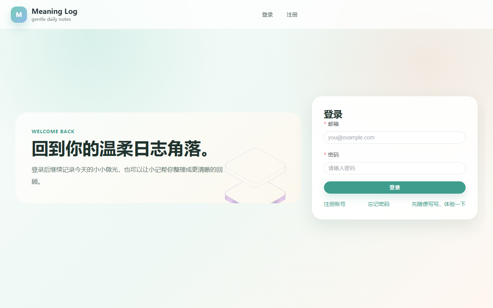
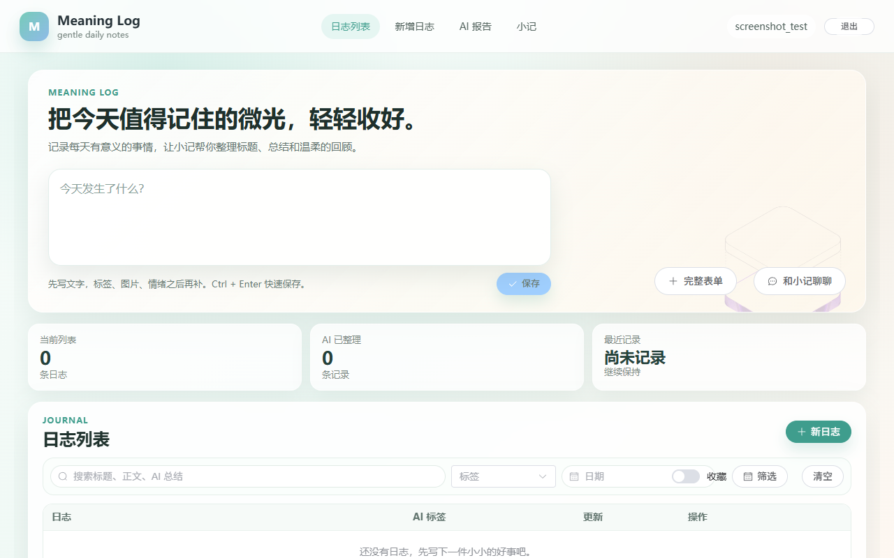
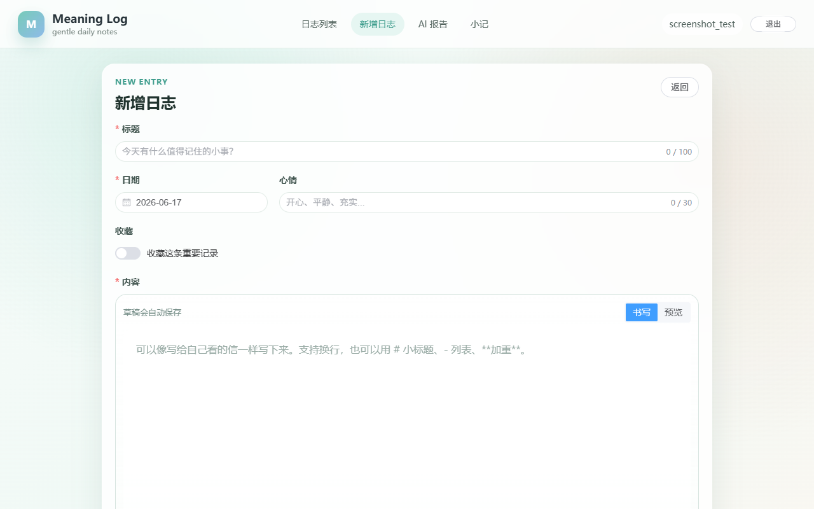
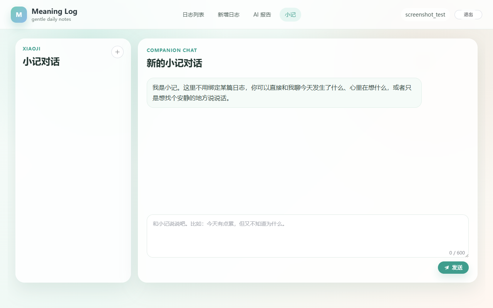

# Meaning Log

一个 AI 辅助日记应用。

写完日志后，系统可以自动生成标题、总结和标签；你也可以继续和 AI 对话，迭代润色日志或报告。项目同时提供游客试用、日报总结、阶段性报告和“小记”陪伴聊天。

## 当前能力

- 用户注册、登录、重置密码、邮箱验证码
- 日志 CRUD、收藏、关键词/标签/日期筛选
- 日志图片上传与展示
- 单篇日志 AI 整理：标题、摘要、标签、对话精修、Apply 应用
- 日报总结与区间 AI 报告生成
- 报告二次对话与内容应用
- 游客试用一次 AI 整理，注册后自动承接结果
- 独立的“小记”陪伴聊天会话
- SSE 流式输出，适用于聊天和报告生成场景

## 技术栈

| 层 | 技术 |
| --- | --- |
| Frontend | Vue 3, TypeScript, Vite, Pinia, Vue Router, Element Plus |
| Backend | Spring Boot 3, Java 17, MyBatis-Plus, Spring Security, JWT |
| Database | MySQL 8 |
| Cache / Rate Limit | Redis |
| AI | DeepSeek OpenAI 兼容接口，默认模型 `deepseek-chat` |

## 项目结构

```text
meaning-log/
├─ meaning-log-frontend/   # Vue 3 前端
├─ meaning-log-backend/    # Spring Boot 后端
├─ docs/                   # 开发基线、验收清单、重构记录
└─ README.md
```

## 页面截图

### 登录 / 注册

<table>
  <tr>
    <td></td>
    <td></td>
  </tr>
</table>

### 日志主页


### 新建日志



### 小记聊天



## 本地运行

### 1. 前置条件

- Java 17
- Node.js 20+
- Docker Desktop（推荐，用于 MySQL 与 Redis）

没有 Docker Desktop 时，也可使用本机已有的 MySQL 8 和 Redis，但需要自行保证它们分别监听在 `3306` 和 `6379`。

### 2. 首次配置

在仓库根目录创建 Docker Compose 的本地变量文件：

```cmd
copy .env.example .env
```

复制后端与前端的本地配置样例：

```cmd
copy meaning-log-backend\application-local.properties.example meaning-log-backend\application-local.properties
copy meaning-log-frontend\.env.local.example meaning-log-frontend\.env.local
```

打开 `meaning-log-backend/application-local.properties`，填写自己的 DeepSeek Key；示例已提供仅供本地开发的 JWT 密钥。运行本地后端时设置 `SPRING_PROFILES_ACTIVE=local`，生产环境必须设置 `JWT_SECRET`：

```properties
app.ai.api-key=your-deepseek-api-key
```

从旧版本升级时，如本地文件仍使用 `ai.api-key`，当前版本会继续兼容读取；下次编辑时将该键改为 `app.ai.api-key` 即可。

`.env`、`application-local.properties`、`application-docker.properties` 和 `.env.local` 均被 Git 忽略，真实密码与 API Key 不会进入提交。Docker Compose 会创建 `meaning_log` 数据库、`meaning_log` 本地数据库账号和 Redis；后端首次启动时自动执行 `schema.sql`。

### 3. 启动依赖服务

```cmd
docker compose up -d
docker compose ps
```

MySQL 和 Redis 第一次初始化需要几十秒，直到两项状态均为 `healthy` 再启动后端。

> 本机已有 MySQL 或 Redis 占用 `3306` / `6379` 时，先停止旧服务，或在 `.env` 修改 `MYSQL_PORT` / `REDIS_PORT`，并同步更新 `application-local.properties` 的连接配置。

### 4. 启动后端

后端默认端口是 `8080`。

```cmd
cd meaning-log-backend
set SPRING_PROFILES_ACTIVE=local
mvnw.cmd spring-boot:run
```

### 5. 启动前端

前端默认端口是 `5173`。

```bash
cd meaning-log-frontend
npm install
npm run dev
```

启动后访问 [http://localhost:5173](http://localhost:5173)。

### 日常开发

首次配置完成后，日常只需分别执行：

```cmd
docker compose up -d
```

```cmd
cd meaning-log-backend
mvnw.cmd spring-boot:run
```

```cmd
cd meaning-log-frontend
npm run dev
```

停止依赖服务使用 `docker compose down`。不要随意执行 `docker compose down -v`，该命令会删除本地 MySQL 与 Redis 数据卷。

## 关键配置

后端主要配置文件是 `meaning-log-backend/src/main/resources/application.properties`。

常用环境变量：

| 变量 | 说明 | 默认值 |
| --- | --- | --- |
| `MYSQLHOST` | MySQL 地址 | `localhost` |
| `MYSQLPORT` | MySQL 端口 | `3306` |
| `MYSQLDATABASE` | 数据库名 | `meaning_log` |
| `MYSQLUSER` | MySQL 用户 | `root`（兼容旧本机环境） |
| `DB_PASSWORD` | MySQL 密码 | `your-db-password-here` |
| `REDIS_HOST` | Redis 地址 | `localhost` |
| `REDIS_PORT` | Redis 端口 | `6379` |
| `REDIS_PASSWORD` | Redis 密码 | 空 |
| `DEEPSEEK_API_KEY` | DeepSeek API Key（部署时使用） | 无，必须配置 |
| `APP_AI_BASE_URL` | AI 接口基地址 | `https://api.deepseek.com/v1` |
| `APP_AI_MODEL` | AI 模型名 | `deepseek-chat` |
| `JWT_SECRET` | JWT 密钥 | 必须配置；本地可使用 `application-local.properties` 示例值 |
| `MAIL_HOST` | SMTP Host | `smtp.qq.com` |
| `MAIL_PORT` | SMTP Port | `465` |
| `MAIL_USERNAME` | 发信邮箱 | `your-email@qq.com` |
| `MAIL_PASSWORD` | SMTP 授权码 | `your-smtp-authorization-code` |
| `MAIL_FROM` | 发信人 | `your-email@qq.com` |

## 验证命令

```bash
# 前端类型检查
cd meaning-log-frontend
npm run type-check

# 前端构建
cd meaning-log-frontend
npm run build

# 后端测试
cd meaning-log-backend
./mvnw test
```

Windows 下最后一条改成：

```powershell
cd meaning-log-backend
.\mvnw.cmd test
```

## 开发说明

- `docs/development-baseline.md`：开发基线与分层约束
- `docs/manual-acceptance-checklist.md`：手工验收清单
- `docs/high-risk-areas.md`：高风险改动区域说明

## 持续集成

每个推送和 Pull Request 都会触发 GitHub Actions：前端执行类型检查与构建，后端在临时 MySQL/Redis 服务中执行测试。CI 不使用真实 DeepSeek Key，也不会调用外部模型接口。
